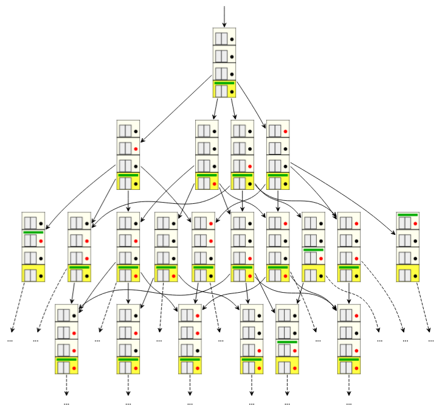
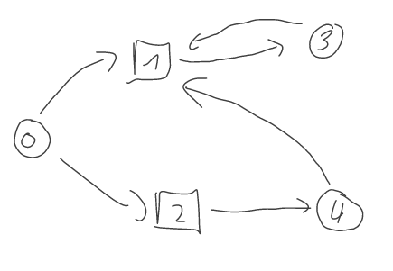
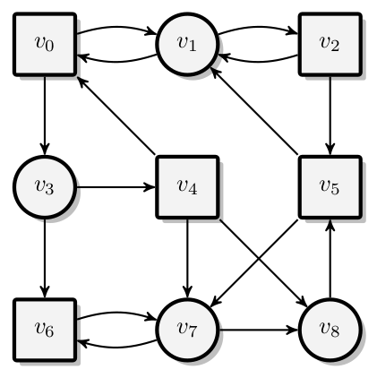

# Session 1: Games, Automata and Synthesis

## Introduction

**Traditional program verification**

```cpp
int cut_square(int i)
    return i <= 0 ? 0 : i*i;
```

. . . 

**Requirements (What needs proofing)**

- The output is always ``>= 0``{.cpp}
- The output is always larger or equal to the absolute value of the input

. . . 

**Approach (How to prove)**

- Establish invariant
- Use some form of induction
- May rely on external solvers like SAT or SMT

**Needs**

A clear first input then output relation

## Introduction

**Model checking**

::::::{ .columns }
:::{ .column width=40% }

```cpp
int next_move(state* cstate)
    // ...
    return nm;
```

:::
:::{ .column width=60%}

```cpp
void next_state(state* cstate, 
                state* nstate, int nm)
    // ...
```

:::
::::::

Works on *infinite* behavior, reasons about continuous systems

. . . 

**Requirements (What needs proofing)**

- Some logical specification
  The elevator will at some point open its door at every floor to which it is called.

. . . 

**Approach (How to prove)**

- Translate (the negation of) the specification and the model to some finite automaton
- Check that there exists no run violating the specification

. . . 

**Needs**

A continuously executing system

## Model checking: A closer look

\Begin{definitionsnippet}{Correctness}
The model may not exhibit a single trace violating the specification
\End{definitionsnippet}

. . . 

### The elevator model

- *Specification*: How the elevator should behave governed by the
- *Controller*: Choosing the next action as a function of 
- *State*: the current position of the elevator and the
- *Environment*: behavior, that is which floors are demanded

. . . 

The run is a succession of actions of the environment (choices over the environment APs) and the controller (choices over the controlled APs).

. . . 

The model is **correct** if the controller can guarantee the specification for 
**all** valid moves of the environment.

## Model checking: A closer look

{width=75%}


## Introducing: Synthesis

**Synthesis** is so to speak the flip-side of verification:

Instead of verifying that a model/controller verifies a specification,
why not directly generate it such a manner?

. . . 

Intuitively, the idea is to make the *choices* explicit and create a two-player game between the environment (*env*, player 0) and the controller (*player*, player 1).


. . . 

If the controller can always *win* the game, he has an answer or strategy for all possible environment behaviors. This strategy then by construction verifies the specification.

## Introducing: Synthesis

Simplified 2 wins: Env wins if it can occupy a diagonal at any point

{width=75%}

## Definition 1
We are only concerned with 2 player games with perfect information.

The game is played between player 0 (the *Env*) and player 1 (the *Player*).
To ease notations, we also define player $i$ ($i \in [0,1]$) and his opponent player $i-1$.

. . . 

\Begin{definitionsnippet}{Arena}
An arena $\A=(V,V_0,V_1,E)$
- a finite set of vertices $V$
- the set of vertices $V_i$ owned by player $i$ partitioning $V$
- $E\subseteq V \times V$ the set of directed edges
- for every vertex $v$ the set $\{v' | (v,v')\in E\}$ is non-empty
\End{definitionsnippet}

. . . 

We say arena is **alternating** if for every edge $(v,v')\in E$ we have $v \in V_i$ and $v' \in V_{i-1}$

## Definition 2

\Begin{definitionsnippet}{Sub-Arena}
Let $\A$ be an arena and $V' \subseteq V$ a subset of vertices.

The sub-arena of $\A$ induced by $V'$ called $\A_{V'}$ is defined as

$\A_{V'} = (V',V_0\cap V',V_1\cap V',E \cap (V'\times V'))$
\End{definitionsnippet}

. . . 

Note that not all sets $V'$ induce a sub-arena: for instance the rule that a successor needs to exist may be violated.

. . . 

::::::{ .columns }
:::{ .column }

{width=80%}

:::
:::{ .column }

- $V'=\{1,3\}$ induces a sub-arena
- $V'=\{2,4\}$ does not

:::
::::::

## Definition 3

Intuitively, during the play the players push a token along the edges of the arena, whoever own the vertex decides on the next edge to use.
During this process, we record the vertices (and  sometimes) edges
seen.

\Begin{definitionsnippet}{A Play}
A play in $\A$ is an infinite sequence $\rho = \rho_0 \rho_1 \rho_2 \rho_3 \dots \in V^{\omega}$ such that $\rho_n \rho_{n+1} \in E$ holds for all $n\in\N$.
\End{definitionsnippet}

. . . 

\Begin{definitionsnippet}{A Strategy}
A strategy for player $i$ ($i\in\{0,1\}$) in an arena $\A$ is a function $\delta_i:V^*V_i \rightarrow V$ s.t. $\delta_i(wv) = v'$ implies $(v,v')\in E$ for every $w$ and $v$.
\End{definitionsnippet}

. . . 

In other words, a strategy decides what to do next given the history of the game and its choice is possible in $\A$.

## Definition 4

\Begin{definitionsnippet}{A consistent play}
A play in $\A$ is **consistent** with a strategy $\delta_i$ for player $i$ if $\rho_{n+i}=\delta_i(\rho_0, \ldots, \rho_n)$ for every $n\in \N$.
\End{definitionsnippet}

. . . 

And 
\Begin{definitionsnippet}{Positional strategy}
A strategy $\delta_i$ is called positional (or memoryless) if  $\delta_i(wv) = \delta_i(v)$ for all $w\in V^*$ and $v\in V$.
\End{definitionsnippet}

Since positional strategies are function from $V$ to $V$ (instead of $(V^*\times V)$ to $V$) we also denote them as such.

## Definition 3&4 illustrations

::::::{ .columns }
:::{ .column width=40% }

{width=100%}

player $0$: circles

player $1$: squares

:::
:::{ .column width=60% }
- $v_0v_3(v_6v_7)^\omega$ is a play
- *go right* is a positional strategy for player $0$
- $v_0(v_1v_2v_1v_2v_5v_1)^\omega$ is a play consistent with the positional strategy *go right* for player $0$

. . . 


- Give the positional strategy $\delta_1$ consistent with $v_0(v_1v_2v_1v_2v_5v_1)^\omega$ 


- Given we start in $v_0$, is there a strategy for player $1$ to reach $v_6$?

:::
::::::


## Definition 5 (and final) [at least for now]

We can finally properly define a game
\Begin{definitionsnippet}{Game}
A game $\G$ is defined by the tuple $(\A, Win)$ with $\A$ being the arena and
$Win \subseteq V^\omega$ being the winning sequences.

We say the game is won by player 1 if and only if $\rho \in Win$. Otherwise it is won by player 0. 
\End{definitionsnippet}

. . . 

\Begin{definitionsnippet}{Winning Strategy}
A strategy $\delta_i$ for player $i$ is called a **winning strategy** for vertex $v$ if all plays starting $v$ and consistent with $\delta_i$ are won by player $i$.
\End{definitionsnippet}

. . . 

\Begin{definitionsnippet}{A Winning Region}
The winning region $W_i(\G)$ of player $i$ is the set of vertices from which player $i$ has a winning strategy.
\End{definitionsnippet}


## On winning regions

\Begin{lemmasnippet}{Lemma: Winning regions do not intersect}
or $W_0(\G) \cap W_1(G) = \emptyset$
\End{lemmasnippet}

. . . 

*Proof.* Let $\G = (\A, Win)$. Towards a contradiction, assume there exists a vertex $v \in W_0(\G) \cap W_1(\G)$.

Then, both players have a winning strategy from v, call them $\delta_0$ and $\delta_1$. Let $\rho = \rho(v, \delta_0, \delta_1)$, i.e., we let the
players both use their winning strategy against each other, the play is consistent with both strategies.

Then, $\rho \in Win$, as $\delta_1$ is a winning strategy for player $1$ and $\rho \notin Win$, as $\delta_0$ is a winning strategy for
player $0$. 

Hence, we have derived the desired contradiction.

## On winning regions and determinacy

Last slide we have shown that winning regions are always disjoint.

. . . 

The other question is whether they also partition the vertices, that is whether $W_0(\G) \cup W_1(\G) = V$.

. . . 

\Begin{definitionsnippet}{[Positional] Determinancy}
Let $\G$ be a game with vertex set V. 

We say that $\G$ is determined if $W_0(\G) \cup W_1(\G) = V. 
Furthermore, we say that $\G$ is positionally determined if,
from every vertex $v \in V$ one of the players has a positional winning strategy.
\End{definitionsnippet}

. . . 

Note the subtlety "one of the playes has **a** positional winning strategy [for each vertex $v$]".

This indicates that the positional strategy may depend on the initial vertex.

. . . 

If a positional strategy does **not** depend on the initial vertex, we call it a
**uniform** positional winning strategy.

## Useful notions on games 1

### It is a Trap

Intuitively, a trap is a set of vertices from which the trapped player may not escape without the help of the other.